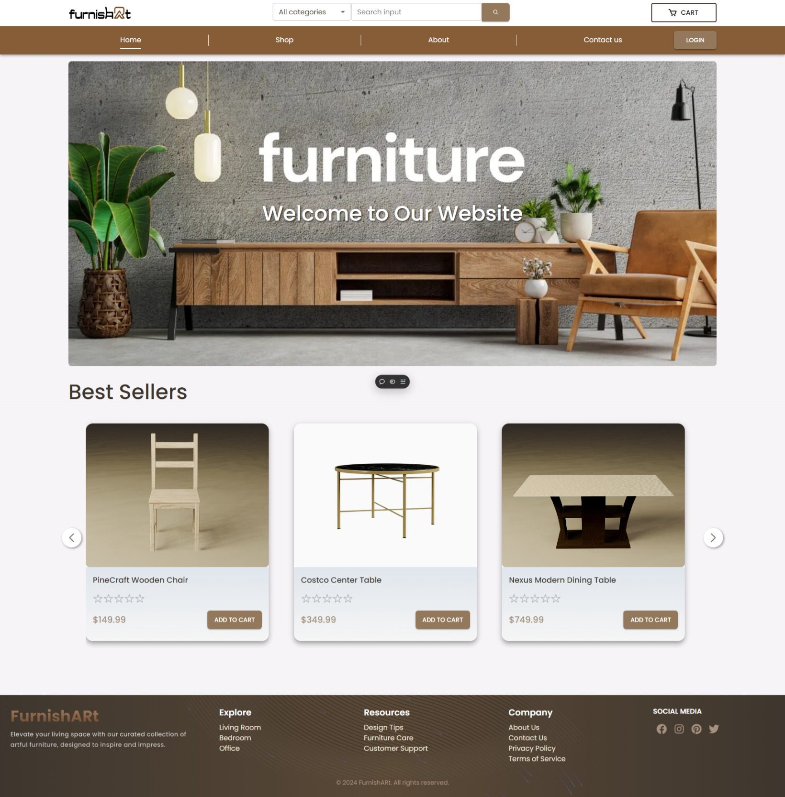
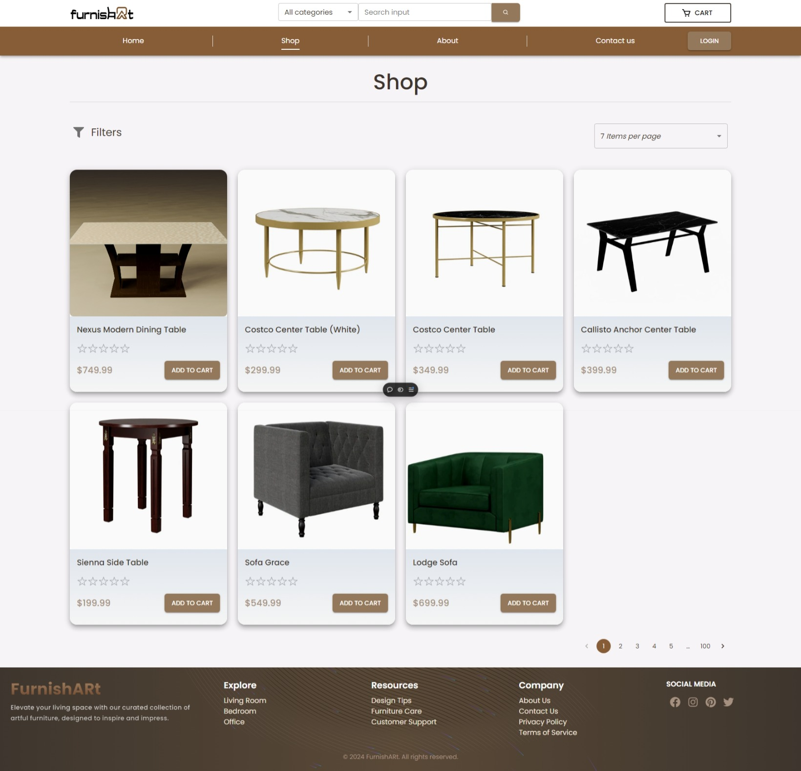
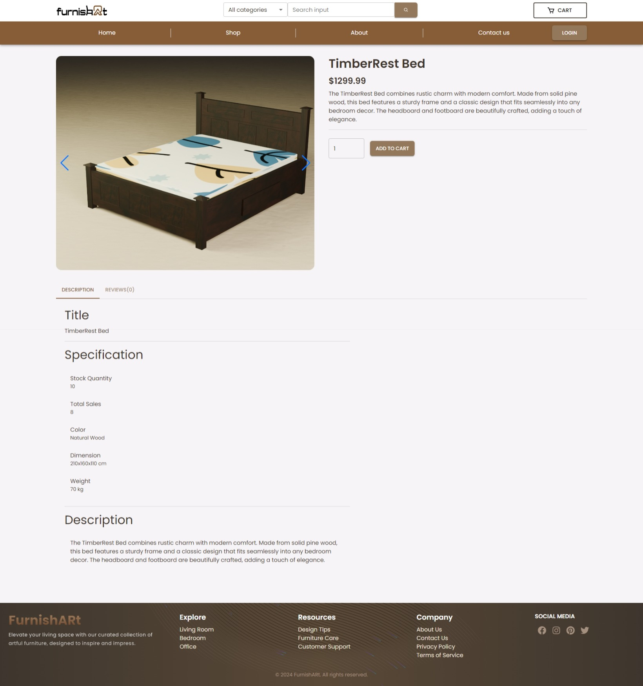
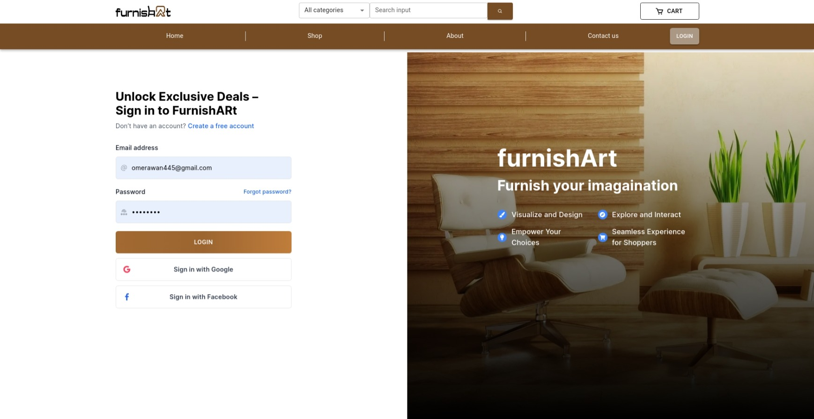
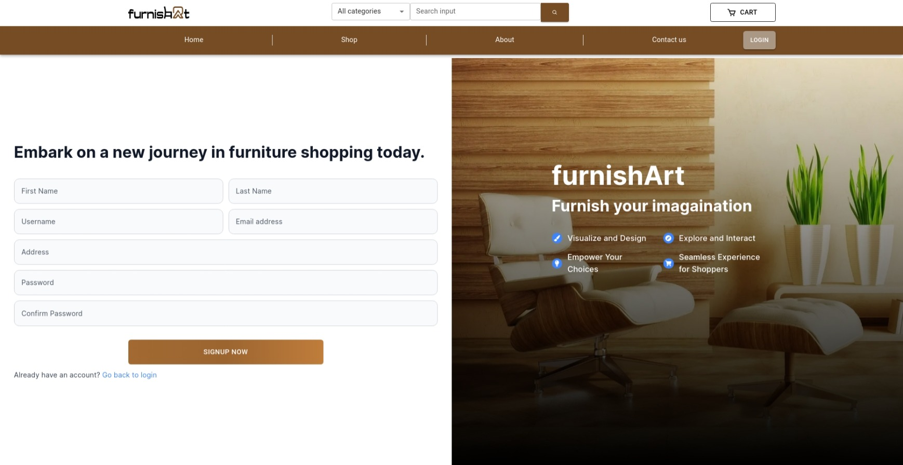
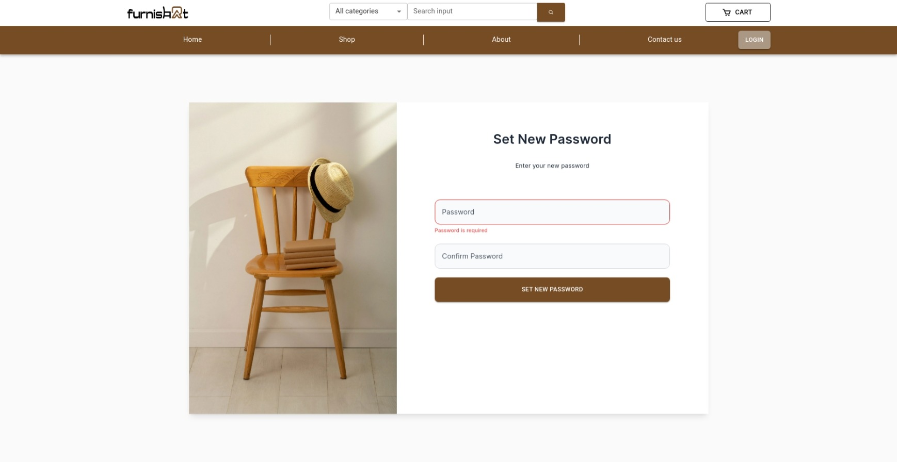
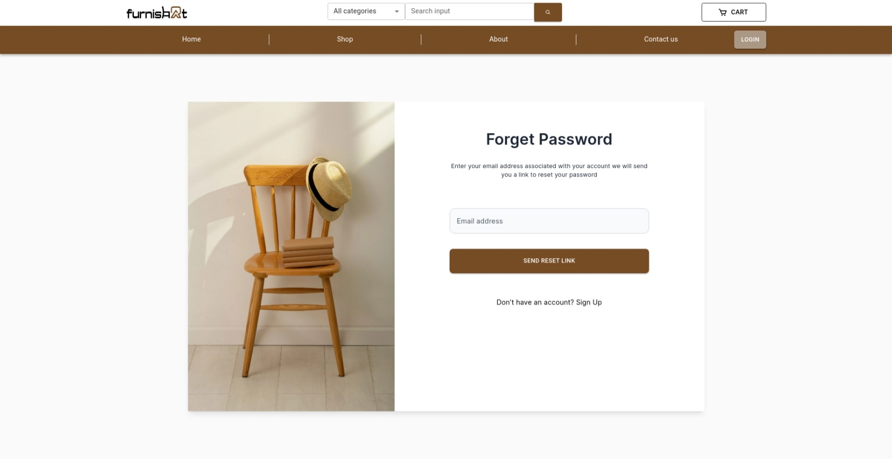
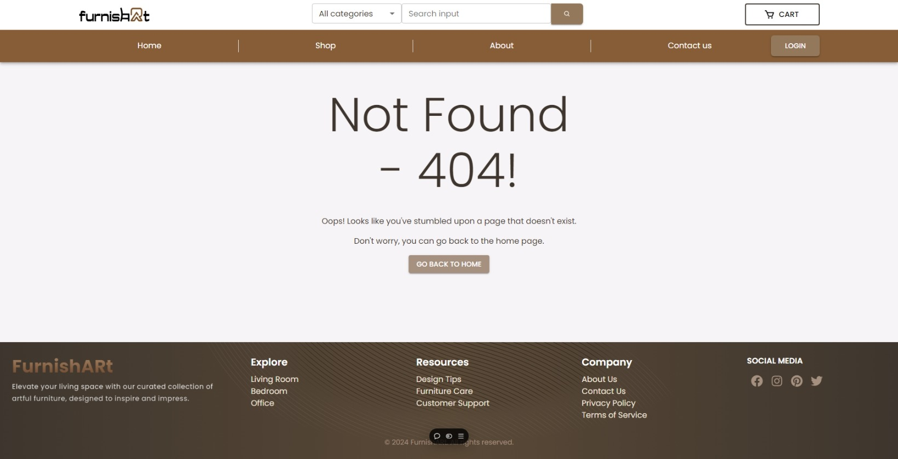

# furniARt - Augmented Reality-Based Online Furniture Store

  

**furniARt** is an AR-based online platform designed to revolutionize the shopping experience by allowing users to interact with and visualize furniture in their own spaces using augmented reality. Customers can see how items will fit and look in their homes before making a purchase, bridging the gap between online and offline shopping.

## Project Overview

  

### Abstract

  

The goal of this project is to create an AR-based online furniture store that enhances customer experience by providing an immersive way to view and interact with virtual 3D furniture models in their own space. This platform bridges the gap between online and offline shopping, helping customers make well-informed purchasing decisions.

  

  

### Introduction

  

The advent of AR technology offers innovative opportunities to enhance e-commerce. This project leverages AR to allow customers to preview furniture in their real-world environment, thus enhancing the shopping experience and driving informed purchasing decisions.

  
  

## Main Features:

  

-  **AR Visualization:** View and place 3D furniture models in real-world environments.

  

-  **3D Model Viewing:** Loading 3D Model and viewing it on website using three.js.

  

-  **Real-Time 3D Model Loading:** Dynamic loading and real-time augmentation of furniture models in app using unity.

  

-  **Secure Transactions:** Safe and reliable payment processing.

  

-  **Customer Reviews**: Read and write reviews to make informed purchasing decisions.

  

-  **Order Management:** Track order status, view order history and manage the shopping cart.

  

-  **Inventory Management:** Efficient management of furniture listings, stock levels, and inventory reports through an admin panel.

  

## Media

  

### Demo Video and Images

  

-  ### 3D Model Demo
https://github.com/user-attachments/assets/7f198166-e711-436d-8827-5f3fbc76fcfb

-  ### Home Page:



-  ### Shop Page:



-  ### Cart Page:


-  ### Furniture Item Detail Page:



-  ### Checkout Page (Saved Credit Cards):

.jpeg)

-  ### Checkout Page (Stripe Form):

.jpeg)

-  ### Login Page:



-  ### Signup Page:



-  ### Reset Password Page:



-  ### Forget Password Page:



-  ### 404 Page:



  

## How to Run the Project


### Prerequisites

1.  **Node.js** and **npm** (or yarn) installed.

2.  **PostgreSQL** database.

3.  **Docker** installed for containerization.

4.  **Cloudflare** R2 setup for asset storage.

  


### Steps

**1. Clone the repository:**
```
git clone https://github.com/OmerAwan445/furnishARt_fullstack.git
cd furnishARt_fullstack
``` 

**2. Set up the backend:**

```
cd backend 
npm install
npm run dev
```
**3. Set up the frontend:**

``` 
cd ../frontend
npm install
npm run dev
``` 

**4. Set up environment variables:**

- Create a `.env` file in both the `backend` and `frontend` directories.

- Configure them based on the `.env.example` file provided in each directory

  

**5. Initialize the database:**

- Run the SQL queries provided in the `insert_dummy_data.sql` file to insert dummy data

  

**6. Run the project:**

- After completing the setup, you can run the frontend and backend using the commands specified above (`npm run dev`), or you can run the project using Docker Compose (preferred for production).

  

### Running with Docker Compose

  

To run the entire project with Docker Compose, follow these steps:

  

**1. Build the Docker images:**

```
docker-compose build
```

**2. Start the containers:**

``` 
docker-compose up
```

**3. Insert Dummy Data in DB**

-  **Navigate to the database container:**

```
docker exec -it furnishart-db sh
```

-  **Log in to the Postgres database and Create DB:**

```
psql -U postgres -d posgtres
CREATE DATABASE furnishart-db;
```

Now insert dummy data queries from `insert_dummy_data.sql` file.

  

This will automatically set up the backend, frontend, and database as defined in the `docker-compose.yaml` file.

  

### Frontend Deployment

  

- The frontend is live and hosted on **Vercel**. Access it here: [furniARt on Vercel](https://furnishart.vercel.app/).

  

### Backend Deployment

  

- The backend is live on an **AWS t2.micro** instance.

  

### Note on Performance

  

Since all components of the project (backend, frontend, and assets) are hosted on free-tier services (AWS t2.micro, Vercel, and Cloudflare R2), the live demo might experience slower performance.
